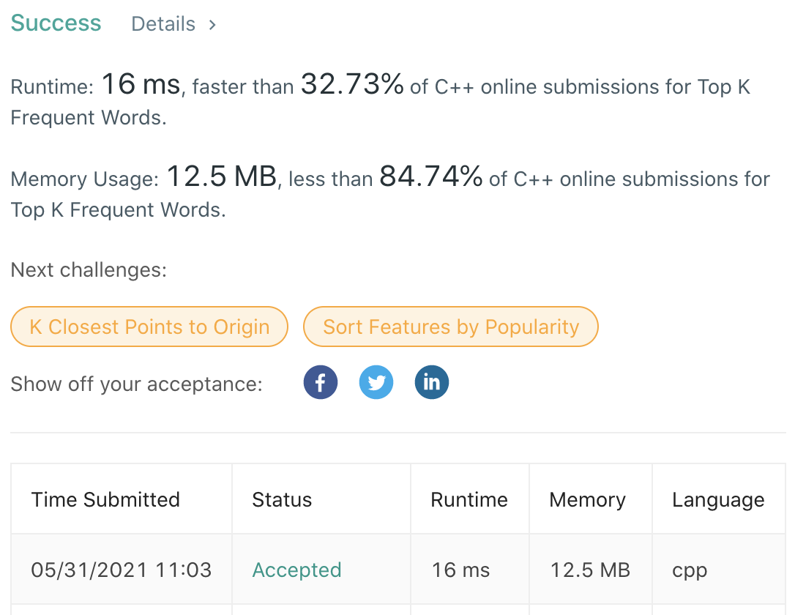

# LeetCode-692

题目链接：https://leetcode.com/problems/top-k-frequent-words/

## 算法思路

题目要求字符串数组中，出现次数前K高的字符串，如果次数相同，则按照字典序小的进行返回。通过维护一个字符串出现次数的最小堆，并保证其大小为K，从而可以保证算法复杂度在O(nlogk)。但是由于返回的是字符串，所以，最小堆存储的是（次数，字符串）的二元组，同时二元组的大小序为：次数不同，比次数（降序），次数相同比字符串字典序（升序）。

## 代码

```cpp
class Solution {
public:
    struct Comp {
        bool operator()(const pair<int, string>& a, const pair<int, string>& b) const {
            if (a.first != b.first)
                return a.first > b.first;
            return a.second < b.second;
        }
    };

    vector<string> topKFrequent(vector<string>& words, int k) {
        unordered_map<string, int> m;
        for (auto &word : words)
            m[word] += 1;

        priority_queue<pair<int, string>, vector<pair<int, string>>, Comp> pq;
        for (auto &p : m) {
            pq.emplace(p.second, p.first);
            if (pq.size() > k)
                pq.pop();
        }

        vector<string> ans;
        while (!pq.empty()) {
            ans.insert(ans.begin(), pq.top().second);
            pq.pop();
        }

        return ans;
    }
};
```

## 测试截图


