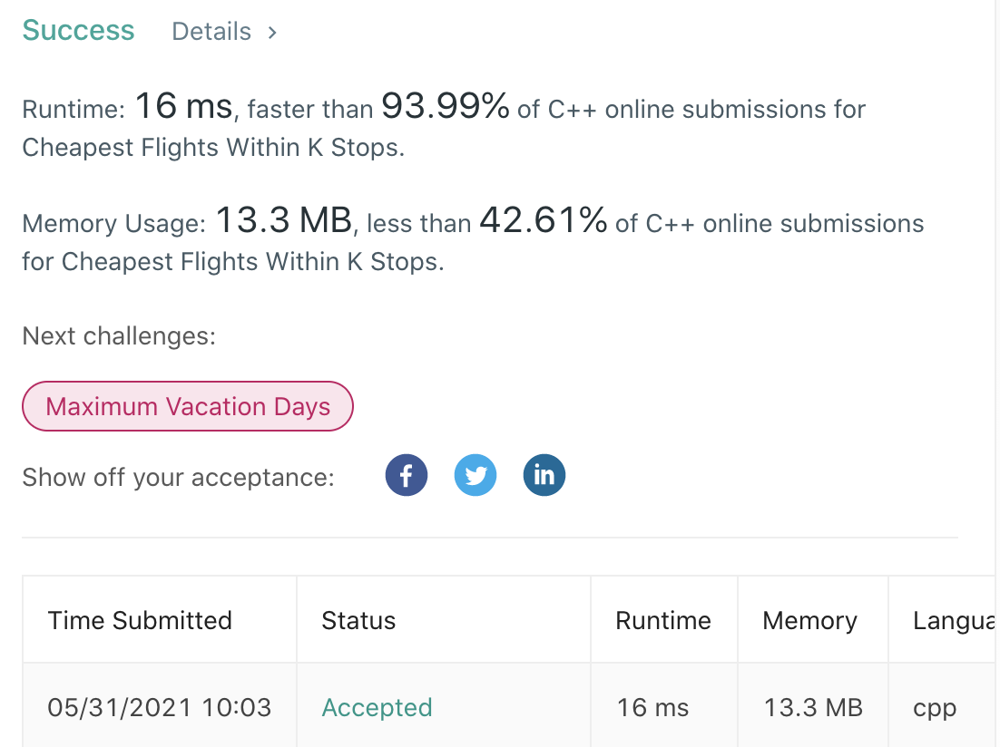

# LeetCode-787

题目链接：https://leetcode.com/problems/cheapest-flights-within-k-stops/

## 算法思路

给定一个图，节点代表城市，边代表航班价格。现要求，从指定城市出发，中间最多停留k个城市，然后到达目标城市的最便宜航班价格。

将K+1看作深度，利用BFS可以求得题目希望的最便宜航班价格，即队列中存储（价格，停靠次数，当前城市），这样可以保证不超过停靠次数，同时找到最小价格。但是，BFS会TLE(超时)，所以需要优化一下。考虑狄杰斯特算法（在带权图中求source到target的最短路径算法），与题目比较近似。所以，参考该算法思想，将bfs变为优先遍历，即每次从队列中取出最小航班价格路线，进行扩充。很不幸的是，依旧TLE。那么，再考虑加入一个城市节点数组，它存储（src到该城市的最低价格，停靠次数）。通过这个数组，每次在更新遍历队列时，将队头的城市数据与该数组中的城市数据进行对比，如果队头的价格已经高出数组价格，说明这不是一个最优航道，之前存在一个更便宜的航道，所以直接放弃队头数据即可。通过这样一个记忆的最优航道数组，可以大幅提升算法速度，从而不会TLE。


## 代码

```cpp
class Solution {
private:
    int ans = INT_MAX;
public:
    int findCheapestPrice(int n, vector<vector<int>>& flights, int src, int dst, int k) {
        vector<vector<pair<int, int>>> g(n);

        for (auto &f : flights)
            g[f[0]].emplace_back(f[1], f[2]);

        typedef tuple<int, int, int> Type;
        priority_queue<Type, vector<Type>, greater<Type>> pq;
        vector<pair<int, int>> dist(n, {INT_MAX, INT_MAX}); // dist, step

        pq.emplace(0, -1, src); // cost, step, node
        while (!pq.empty()) {
            auto [cost, step, node] = pq.top();
            pq.pop();

            // cheapest flight
            if (node == dst and step <= k)  return cost;

            // out of k stop
            if (step >= k)  continue;

            // exist another smaller step with cheaper flight
            if (cost >= dist[node].first and step >= dist[node].second)
                continue;
            else // update smaller step and cheaper flight
                dist[node] = {cost, step};

            for (auto [x, y] : g[node]) {
                if (cost+y < dist[x].first or step + 1 < dist[x].second)
                    pq.emplace(cost+y, step+1, x);
            }
        }

        return -1;
    }
};
```

## 测试截图


