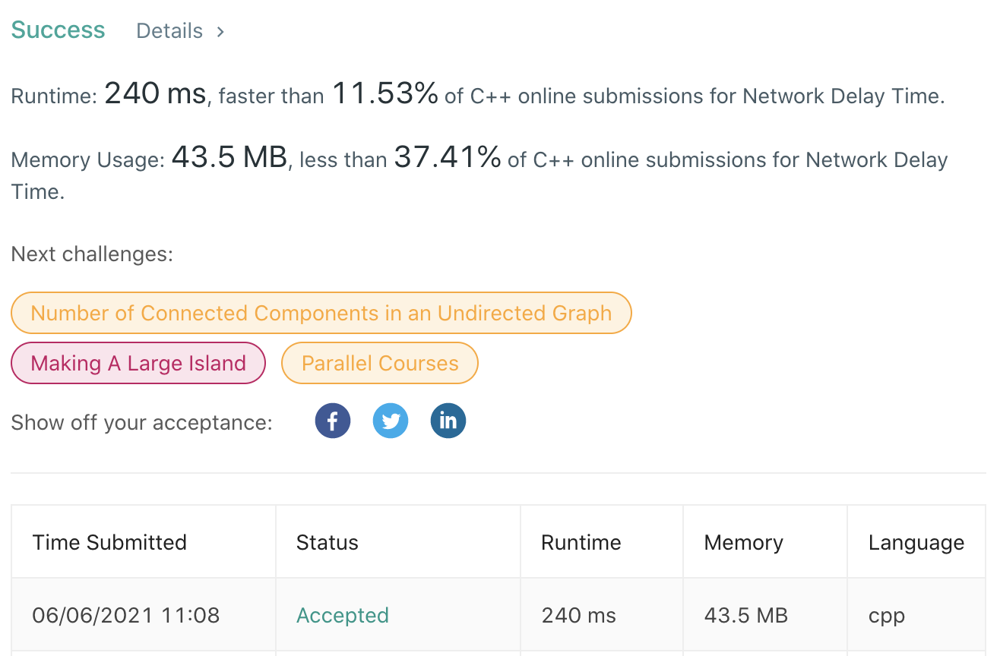

# LeetCode-743

题目链接：https://leetcode.com/problems/network-delay-time/

## 算法思路

给定一个包含n个节点的图，节点之间的边表示从一个节点到另一个节点的传输时间。题目要求，从某个节点向图中其余节点广播信号所需要的传输时间。如果图中有节点无法接收到信号，则返回-1。

概括而言，题目要求给定节点到图中剩余节点的最短路径，并返回最大的最短路径长度。如果图中存在从给定节点无法到达的节点，则返回-1。对于图的最短路径问题，可以使用Dijkstra算法，最后统计从给定节点到其余节点的路径的最大值。如果路径值中存在无穷大，返回-1。

## 代码

```cpp
class Solution {
public:
    int networkDelayTime(vector<vector<int>>& times, int n, int k) {
        // construct graph
        unordered_map<int, unordered_map<int, int>> g;
        for (auto &tri : times)
            g[tri[0]][tri[1]] = tri[2];

        int dis = 0, new_dis = 0;
        vector<int> t(n+1, INT_MAX); // time from k to each node;
        t[k] = dis, t[0] = 0;

        // min heap for <time, node> pair
        typedef pair<int, int> Type; // <time, node>
        priority_queue<Type, vector<Type>, greater<Type>> pq;
        pq.push({0, k});

        while (pq.size()) {
            Type p = pq.top(); pq.pop();
            dis = p.first;

            for (auto &n : g[p.second]) {
                new_dis = dis + n.second;
                if (new_dis < t[n.first]) { // new shorter time
                    t[n.first] = new_dis;
                    pq.push({new_dis, n.first});
                }
            }
        }

        int ans = *(max_element(t.begin(), t.end()));
        return ans == INT_MAX ? -1 : ans;
    }
};
```

## 测试截图


