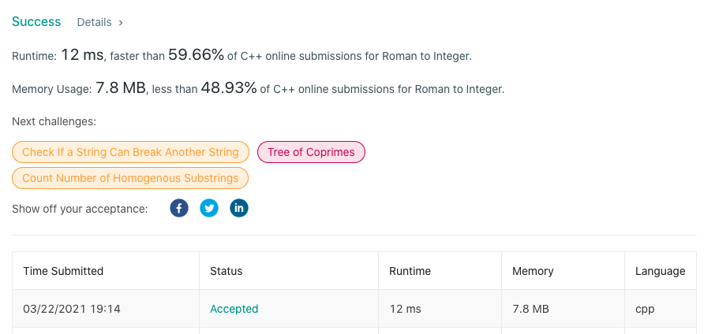

# LeetCode-13

题目链接：https://leetcode.com/problems/roman-to-integer/

## 算法思路

题目要求将罗马数字转换为阿拉伯数字。通关阅读罗马数字的映射规则可以发现，其书写习惯是从左到右，从大到小的顺序排列，且罗马数字的每一个字符可以映射一个数字。所以，先构造字典存储这个基础的字符-数字映射规则。然后，可以发现，从右往左读时，当代表数字小的字符出现在大数字字符的左边，则要用大数字减去小数字，其他时候直接相加。因此逆序遍历罗马数字字符串即可。

## 代码

```cpp
class Solution {
private:
    unordered_map<char, int> r = {
        {'I',1}, {'V',5}, {'X',10},
        {'L',50}, {'C',100},
        {'D',500}, {'M',1000}
    };
public:
    int romanToInt(string s) {
        int size = s.size();
        int ans = r[s[size-1]];
        for (int i = size-2; i >= 0; --i)
            ans += r[s[i]] * (r[s[i]] < r[s[i+1]] ? -1 : 1);
        return ans;
    }
};
```

## 测试截图


