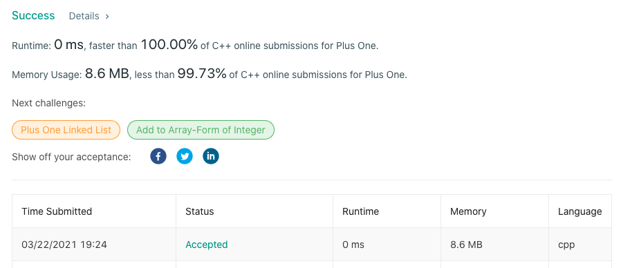

# LeetCode-66

题目链接：https://leetcode.com/problems/plus-one/

## 算法思路

题目要求计算给定数字加一之后的结果，但数字以数组的形式给出。题目的难点在于运算进位，但学习过计算机组成原理或数字电路课程则可以知道，计算机是如何进行加法运算的。

我们使用一个carry变量，存储进位值。从个位开始，每次进行一位运算，即当前数字与carry的运算结果。如果结果大于10，则carry变量置1，结果除以10，反之置0，结果不变。最后，判断carry为是否为0，决定是否需要再进一位，运算完毕。所以，直接使用逆序遍历即可。

## 代码

```cpp
class Solution {
public:
    vector<int> plusOne(vector<int>& digits) {
        int carry = 1, size = digits.size();
        for (int i = size-1; i >= 0; --i) {
            digits[i] += carry;
            carry = digits[i] / 10;
            digits[i] %= 10;
        }

        if (carry)  digits.insert(digits.begin(), 1);
        return digits;
    }
};
```

## 测试截图


