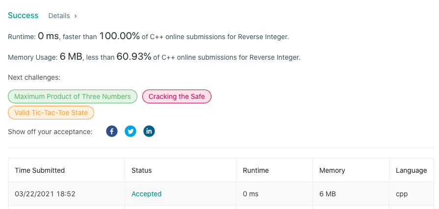

# LeetCode-7

题目链接：https://leetcode.com/problems/reverse-integer/

## 算法思路

题目要求返回给定整数的逆序输出，其中保留符号，逆序数字。同时，限定只能使用整型变量，不能使用long类型。
如果可以使用long类型，可以十分方便的先将数字转为字符串，然后调用reverse，接着再转换为long整数，与边界值比较大小即可确认返回值。
但题目限定不能使用long类型，所以考虑对整数的绝对值进行逆向遍历，同时存储遍历结果，并判断存储结果是否超出范围，最后加入符号返回即可。

*实现细节*
1. int 类型最小值的绝对值会超出 int 类型范围，所以先处理该情况，直接返回0
2. 逆序遍历时，是否溢出不能用乘法，因为乘法结果本身就可能溢出，所以要变形为当前结果与边界值的变换结果的对比

## 代码

```cpp
class Solution {
public:
    int reverse(int x) {
        if (x == INT_MIN)   return 0;

        bool negative = x < 0;

        int ans = 0, tmp = 0;
        x = abs(x);
        while (x > 0) {
            tmp = x % 10;
            if (ans > (INT_MAX - tmp) / 10)  return 0;
            ans = ans * 10 + tmp;
            x /= 10;
        }

        return ans * (negative ? -1 : 1);
    }
};
```

## 测试截图


