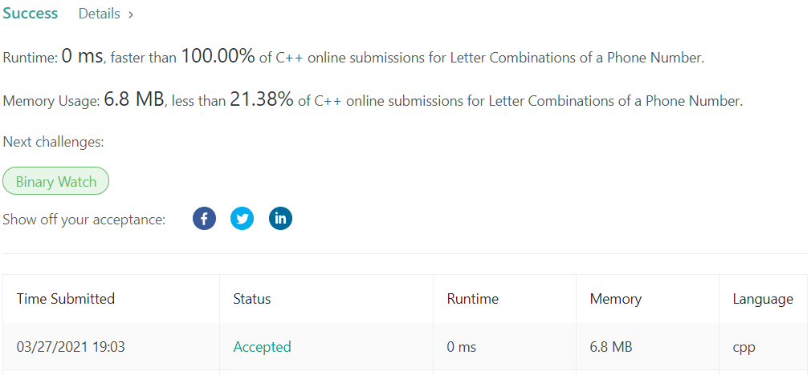

# LeetCode-17

题目链接：https://leetcode.com/problems/letter-combinations-of-a-phone-number/

## 算法思路

题目要将一个数字序列映射成所有可能的字符序列，映射规则是传统的九宫格手机键盘。首先，一个映射规则的字典是必须的，这里我使用了数组代替，因为key是数字，可以直接对应位数组下标，这样定义变量时只需要写英文字母，比较方便。

接着，考虑如何进行映射。考虑通常情况，即已生成前序结果，正在解析当前数字，且并不关心后序数组。此时，对于当前数字的可能结果，就是前序的所有可能结果，加上当前数字可以映射的字母。所以，前面的所有结果是需要存储的。然后直接遍历前序结果与可映射字母，生成当前状态下的所有结果即可。

转变成编程思维就是利用两个数组，交替存储当前结果，与下一次遍历使用的结果。

## 代码

```cpp
class Solution {
private:
    vector<vector<string>> m{{}, {}, {"a", "b", "c"},
        {"d", "e", "f"}, {"g", "h", "i"}, {"j", "k", "l"},
        {"m", "n", "o"}, {"p", "q", "r", "s"}, {"t", "u", "v"},
        {"w", "x", "y", "z"}
    };    
public:
    vector<string> letterCombinations(string digits) {
        if (digits.size() == 0) return {};

        vector<string> ans;
        vector<string> cur{}, next{""};
        for (auto &digit : digits) {
            cur = next, next = vector<string>{};
            for (auto &s : cur)
                for (auto &a : m[digit-'0'])
                    next.push_back(s+a);
        }
        
        return next;
    }
};
```

## 测试截图


