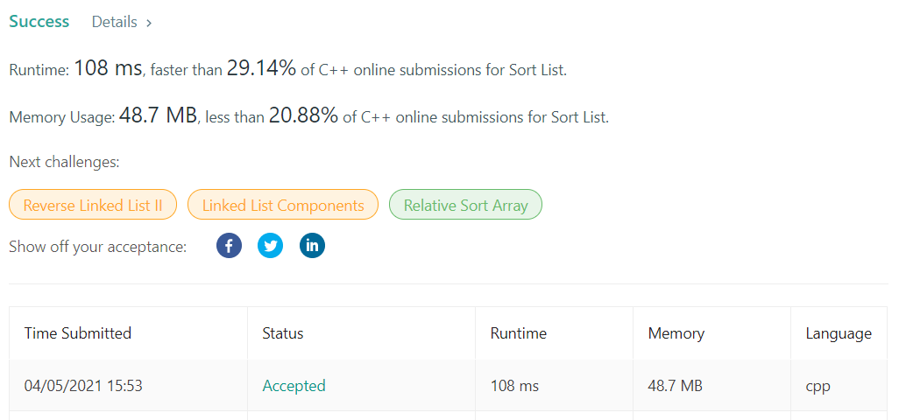

# LeetCode-148

题目链接：https://leetcode.com/problems/sort-list/

## 算法思路

题目要对一个链表进行排序，但是给出了复杂度的要求，空间复杂度为$O(1)$，时间复杂度为$O(nlogn)$。根据要求，可以反推算法实现。这里复杂度出现了$logn$，那么二分就很明显了。但链表明显不适合二分，因为是单链，剩下最接近二分的排序算法就是归并了。所以这里采用归并排序的方法对链表进行排序。

首先利用快慢指针将链表分割为两部分，然后分别调用函数对两个子链表进行排序，最后merge两个子链表即可。

## 代码

```cpp
/**
 * Definition for singly-linked list.
 * struct ListNode {
 *     int val;
 *     ListNode *next;
 *     ListNode() : val(0), next(nullptr) {}
 *     ListNode(int x) : val(x), next(nullptr) {}
 *     ListNode(int x, ListNode *next) : val(x), next(next) {}
 * };
 */
class Solution {
public:
    ListNode* sortList(ListNode* head) {
        if (!head or !head->next) return head;
        
        // cut list into two half
        ListNode *fast = head, *slow = head;
        ListNode *prev = nullptr;
        while (fast and fast->next) {
            prev = slow;
            slow = slow->next;
            fast = fast->next->next;
        }
        
        // prev is the end of left half
        // and slow is the start of right half
        prev->next = nullptr;
        
        ListNode *l1 = sortList(head);
        ListNode *l2 = sortList(slow);
        
        return merge(l1, l2);
    }
    
    ListNode* merge(ListNode *l1, ListNode *l2) {
        ListNode *p = new ListNode(0), *l = p;
        int left = 0, right = 0;
        while (l1 or l2) {
            left = l1 ? l1->val : INT_MAX;
            right = l2 ? l2->val : INT_MAX;
            if (left < right) {
                l->next = l1;
                l1 = l1->next;
            } else {
                l->next = l2;
                l2 = l2->next;
            }
            l = l->next;
        }
        
        return p->next;
    }
};
```

## 测试截图


