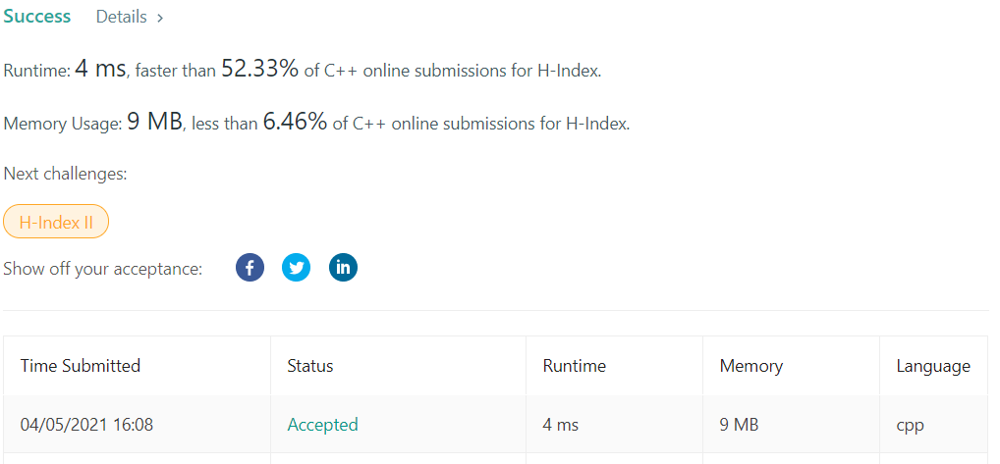

# LeetCode-274

题目链接：https://leetcode.com/problems/h-index/

## 算法思路

题目要求一个研究者的h-index，给出了具体的算法：n篇论文，其中的h篇至少都有h次引用，剩下的n-h篇没有h次引用。两种思路，第一种是对引用次数排序，然后遍历数组，找到第一个不满足条件的h即可，复杂度为$O(nlogn)$，空间复杂度为$O(1)$。另一种牺牲空间换时间，统计所有的论文引用次数频率，遍历频率表，找到h，复杂度为$O(n)$，空间复杂度为$O(n)$，不过题目给了n的最大值1000，所以这里使用固定的大数组，空间复杂度为"$O(1)$"。

## 代码

```cpp
class Solution {
public:
    int hIndex(vector<int>& citations) {
        vector<int> cite_count(1001, 0);
        
        int size = 0;
        for (auto &cite : citations)
            ++cite_count[cite], ++size;
        
        int h = 0;
        for (int i = 1000; i >= 0; --i) {
            h += cite_count[i];
            if (h >= i) return i;
        }
        
        return 0;
    }
};
```

## 测试截图


