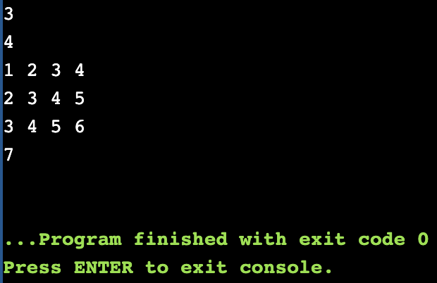

# 投资问题


## 算法思路

将问题转化为数学公式：
maximize &nbsp;&nbsp; sum{ fi(xi) } with i from 1 to n
subject to &nbsp; sum{ xi } = m
这个线性优化问题，可以用拉格朗日乘子法进行求解，求得最优解。但这是一门算法课，所以下面给出解决这个问题的算法思路。

因为这是动态规划专题，所以“因地制宜”，先来定义状态，dp[i][j]：给前面共i个项目投资j元可带来的最大收益。最终结果为dp[n][m]。下面来考虑转移方程，对于dp[i][j]，考虑的就是给第i个项目投资多少钱，可以带来更高的收益，同时，这部分钱应该从前面的项目投资中扣除，因为不能预支后面的钱。所以，方程如下：

dp[i][j] = max(dp[i][j], dp[i-1][j-k]), k 从 0 到 j

动态数组的更新代码也很简单，依照更新来源，确定好循环顺序即可：
```cpp
for (int i = 1; i <= n; ++i)
    for (int j = 1; j <= m; ++j)
        for (int k = 1; k <= j; ++k)
            dp[i][j] = max(dp[i][j], dp[i-1][j-k]+f[i][k]);
```


## 代码

```cpp
#include<iostream>
#include<vector>

using namespace std;

class Solution {
public:
    int investigation(int n, int m, vector<vector<int>> &f) {
        // dp[i][j] => max profit while investigating j money into i project
        vector<vector<int>> dp(n+1, vector<int>(m+1, 0));

        // the max profit of not investigating i project or
        // investigating i project k money
        // dp[i][j] = max(dp[i][j], dp[i-1][j-k]+f[i][k])
        for (int i = 1; i <= n; ++i)
            for (int j = 1; j <= m; ++j)
                for (int k = 1; k <= j; ++k)
                    dp[i][j] = max(dp[i][j], dp[i-1][j-k]+f[i][k]);

        return dp[n][m];
    }
};


int main() {
    int n;
    cin >> n;
    int m;
    cin >> m;
    vector<vector<int>> f(n+1, vector<int>(m+1, 0));
    for (int i = 1; i <= n; ++i)
        for (int j = 1; j <= m; ++j)
            cin >> f[i][j];

    Solution s;
    cout << s.investigation(n, m, f) << endl;
}
```

## 测试截图


