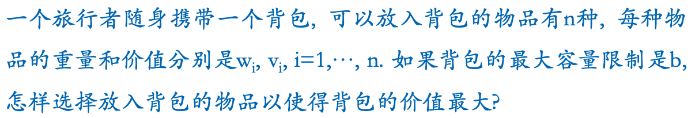
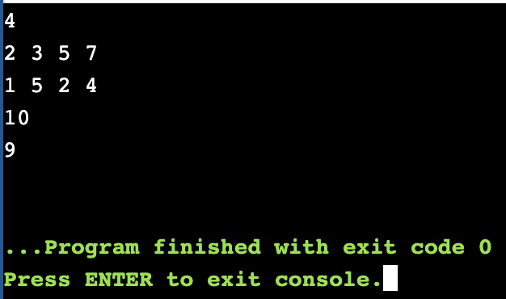

# 背包问题



## 算法思路

背包问题指在多个具备价值和重量的物品中，选择物品放入具有最大负重的背包中，最终要求背包中的物品价值最大。其中较为经典的有01背包和完全背包问题，前者每种物品只有一件，后者则有无数件。依据题意，此处为完全背包问题。

首先来考虑题意中的完全背包问题。题目类似于硬币找零问题，硬币的面值看作重量，找零目标看作最大负重，但不同的是物品比硬币多了一个价值属性，题目的要求也在于满足“找零”的情况下，价值最高。但这并不妨碍使用动态规划进行求解。先给出状态定义，dp[i]：当使用了 i 个重量时，能获取的最大价值，则最终题目要求的就是 dp[w]。下面来考虑状态的转移方程：

dp[i] = max(dp[i], dp[i-w[k]]+v[k]), k 从 0 到 n

方程的含义是，对于当前的 i 个单位重量，其最大价值要么来自于装入一个物品之后的价值，dp[i-w[k]]+v[k]，要么就是之前搜索到的一个最大价值，dp[i]。

代码实现也很简单，两重循环对动态数组进行填表：
```cpp
for (int i = 1; i <= b; ++i)
    for (int k = 0; k < n; ++k)
        if (i >= w[k])
            dp[i] = max(dp[i], dp[i-w[k]]+v[k])
```
注意到，i 一定要比 w[k] 大，所以这里将两层循环调换次序，先遍历k，再遍历 i，这样可以节省循环次数：
```cpp
for (int k = 0; k < n; ++k)
    for (int i = w[k]; i <= b; ++i)
        dp[i] = max(dp[i], dp[i-w[k]]+v[k])
```

上面循环的含义是，对于每一个物品，先将其可以放入背包的状况进行枚举，且重量从小到大，保证了物品可以被放入多次。由此，我们可以直接想到如何利用上面的式子，解决01背包问题。因为，01背包和完全背包的差别在于物品的个数，所以只要保证上面的式子中物品每次只有一次放入机会，就可以解决01背包问题。改动很简单，只需要将内层循环从大到小遍历即可。这样的循环次序可以保证后面的结果不会被前面再次放入物品的结果所影响，即后面的结果每次只能看到放入一个物品之后的结果。
```cpp
for (int k = 0; k < n; ++k)
    for (int i = b; i >= w[k]; --i)
        dp[i] = max(dp[i], dp[i-w[k]]+v[k])
```


## 代码

```cpp
#include<iostream>
#include<vector>

using namespace std;

class Solution {
public:
    int package(int n, vector<int> &w, vector<int> &v, int b) {
        // dp[i] => the max value while using weight i
        vector<int> dp(b+1, 0);
        for (int i = 0; i < n; ++i)
            if (w[i] <= b)
                dp[w[i]] = v[i];

        // dp[i] = max(dp[i-w[k]]+v[k], dp[i]);
        for (int k = 0; k < n; ++k)
            // complete-pack: infinite items per weight
            for (int i = w[k]; i <= b; ++i)
                dp[i] = max(dp[i], dp[i-w[k]]+v[k]);
            // 01-pack: one item per weight
            // for (int i = b; i >= w[k]; --i)
            //     dp[i] = max(dp[i], dp[i-w[k]]+v[k]);

        return dp[b];
    }
};

int main() {
    int n;
    cin >> n;
    vector<int> w(n, 0), v(n, 0);
    for (int i = 0; i < n; ++i)
        cin >> w[i];
    for (int i = 0; i < n; ++i)
        cin >> v[i];

    int b;
    cin >> b;

    Solution s;
    cout << s.package(n, w, v, b) << endl;
}
```

## 测试截图

- 完全背包
    放入3个重量为3的物品，最大价值为15
    

- 01背包
    放入重量为3和重量为7的物品，最大价值为9
    
