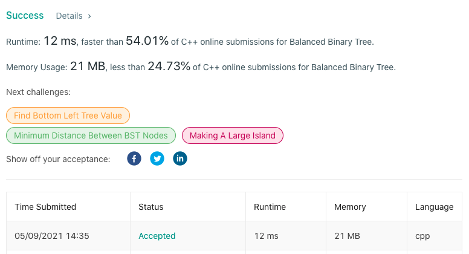

# LeetCode-110

题目链接：https://leetcode.com/problems/balanced-binary-tree/

## 算法思路

题目要判断一个给定的二叉树是否是平衡的二叉树。平衡二叉树的定义为：树中每一个节点的左右子树高度差不大于1。

可以依据定义，采用递归的做法来进行判定：针对当前遍历节点，获取左右子树的高度差；如果当前节点平衡，返回左右子树中的最高高度，否则返回一个特定值，代表当前树不平衡。

## 代码

```cpp
/**
 * Definition for a binary tree node.
 * struct TreeNode {
 *     int val;
 *     TreeNode *left;
 *     TreeNode *right;
 *     TreeNode() : val(0), left(nullptr), right(nullptr) {}
 *     TreeNode(int x) : val(x), left(nullptr), right(nullptr) {}
 *     TreeNode(int x, TreeNode *left, TreeNode *right) : val(x), left(left), right(right) {}
 * };
 */
class Solution {
public:
    int helper(TreeNode* node, int depth) {
        if (!node)  return depth-1;

        int left = helper(node->left, depth+1); // left subtree height
        int right = helper(node->right, depth+1); // right subtree height

        if (abs(right - left) <= 1) // balanced, return max subtree height
            return max(right, left);

        return INT_MAX;
    }

    bool isBalanced(TreeNode* root) {
        return helper(root, 0) != INT_MAX;
    }
};
```

## 测试截图


