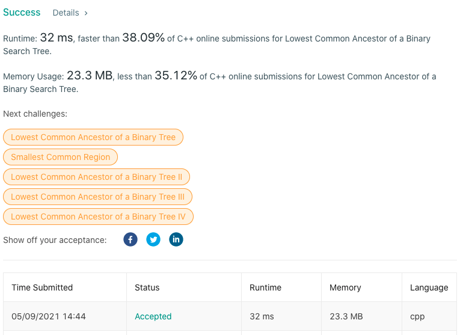

# LeetCode-235

题目链接：https://leetcode.com/problems/lowest-common-ancestor-of-a-binary-search-tree/

## 算法思路

给定一个二叉搜索树以及树中的两个节点，题目要找这两个节点在树中的最近公共祖先。即寻找一个最近的节点，其子树中包含给定的两个节点。

一开始的时候，没有注意到这是个二叉搜索树，所以通解思路就是按遍历顺序，分别记录两个节点的祖先，然后遍历记录的祖先节点，确定最近的公共祖先。代码如下：
```cpp
/**
 * Definition for a binary tree node.
 * struct TreeNode {
 *     int val;
 *     TreeNode *left;
 *     TreeNode *right;
 *     TreeNode(int x) : val(x), left(NULL), right(NULL) {}
 * };
 */

class Solution {
private:

public:
    bool dfs(TreeNode* root, TreeNode* p, vector<TreeNode*> &pp) {
        if (!root)  return false;

        pp.push_back(root); // record ancestor
        if (root == p)  return true;

        if (dfs(root->left, p, pp) or dfs(root->right, p, pp))
            return true;

        pp.pop_back(); // not ancestor, recover
        return false;
    }

    TreeNode* lowestCommonAncestor(TreeNode* root, TreeNode* p, TreeNode* q) {
        vector<TreeNode*> pp, qp;
        dfs(root, p, pp);
        dfs(root, q, qp);

        TreeNode* ans = root;
        int n1 = pp.size(), n2 = qp.size();
        for (int i = 0; i < n1 and i < n2 and pp[i] == qp[i]; ++i)
            ans = pp[i];

        return ans;
    }
};
```

由于给定的树是个二叉搜索树，题目就变得比较简单了。因为二叉搜素树的性质：比节点小的节点在左边，大的在右边，所以从跟节点开始遍历，依据以下情况分类执行：（1）节点值比给定两个节点值都小，查找节点右子树；（2）节点值比给定两个节点值都大，查找节点左子树；（3）节点值等于两个节点值中的一个，返回当前节点（另一个一定是这个节点的子节点）；（4）节点值在给定两个节点值中间，返回当前节点（两个节点都是当前节点的子节点，且不能找到更近的节点了）。

## 代码

```cpp
class Solution {
public:
    int minPathSum(vector<vector<int>>& grid) {
        int row = grid.size(), col = grid[0].size();
        if (row * col == 1) return grid[0][0];

        vector<vector<int>> dp(row, vector<int>(col, 0));
        dp[0][0] = grid[0][0];
        for (int i = 1; i < row; ++i)   dp[i][0] = dp[i-1][0] + grid[i][0];
        for (int j = 1; j < col; ++j)   dp[0][j] = dp[0][j-1] + grid[0][j];

        for (int i = 1; i < row; ++i)
            for (int j = 1; j < col; ++j)
                dp[i][j] = min(dp[i-1][j], dp[i][j-1]) + grid[i][j];

        return dp[row-1][col-1];
    }
};
```

## 测试截图


