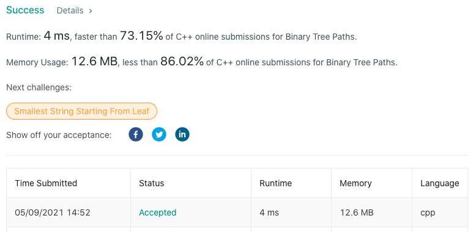

# LeetCode-257

题目链接：https://leetcode.com/problems/binary-tree-paths/

## 算法思路

题目要求给定二叉树中所有从根节点到叶节点的路径。可以利用先序遍历完成：遍历过程中，存储当前遍历的所有节点；当遍历节点是叶子节点时，将记录节点存入返回数组中。

## 代码

```cpp
/**
 * Definition for a binary tree node.
 * struct TreeNode {
 *     int val;
 *     TreeNode *left;
 *     TreeNode *right;
 *     TreeNode() : val(0), left(nullptr), right(nullptr) {}
 *     TreeNode(int x) : val(x), left(nullptr), right(nullptr) {}
 *     TreeNode(int x, TreeNode *left, TreeNode *right) : val(x), left(left), right(right) {}
 * };
 */
class Solution {
public:
    void dfs(TreeNode* node, vector<string> &path, vector<string> &ans) {
        if (!node)  return; // empty node

        if (!node->left and !node->right) { // leaf node
            string res = "";
            for (auto &p : path)
                res += p;
            ans.push_back(res + to_string(node->val));
            return;
        }

        path.push_back(to_string(node->val));
        path.push_back("->");

        dfs(node->left, path, ans);
        dfs(node->right, path, ans);

        path.pop_back(); // recover current node
        path.pop_back();
    }

    vector<string> binaryTreePaths(TreeNode* root) {
        vector<string> ans, path;
        dfs(root, path, ans);
        return ans;
    }
};
```

## 测试截图


