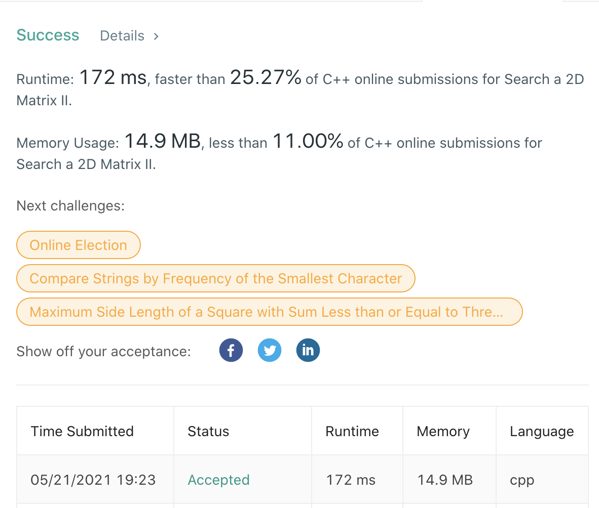

# LeetCode-240

题目链接：https://leetcode.com/problems/search-a-2d-matrix-ii/

## 算法思路

给定一个二维矩阵，其具有如下性质：每一行按升序排列，且每一列按升序排列。现希望在该矩阵中查找一个数是否存在。

如果是无序的矩阵，则需要遍历所有数字，时间复杂度会来到O(m*n)，但题目中的矩阵是行有序和列有序的，所以可以设计一个高效的遍历算法。

指针从矩阵的右上角开始，只有左和下两个方向可以移动，而左测会比当前数小，下方会比当前数大，所以当前数和目标比大小，移动指针。
每次移动完，将指针所在行列看作新矩阵的右上角，重复该过程，若最终没有找到，则返回false即可。
最终的时间复杂度为O(m+n)，即目标数在左下角。

## 代码

```cpp
class Solution {
public:
    bool searchMatrix(vector<vector<int>>& matrix, int target) {
        int row = 0, col = matrix[0].size()-1;
        while (row < matrix.size() and col >= 0) {
            if (matrix[row][col] == target)
                return true;
            else if (matrix[row][col] < target)
                ++row;
            else if (matrix[row][col] > target)
                --col;
        }

        return false;
    }
};
```

## 测试截图


