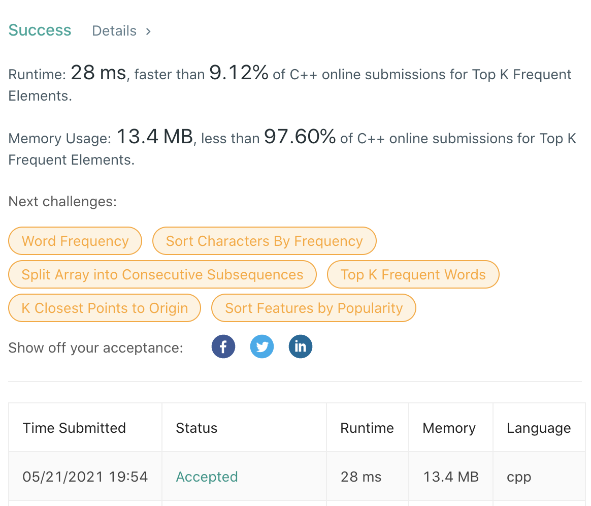

# LeetCode-257

题目链接：https://leetcode.com/problems/top-k-frequent-elements/

## 算法思路

给定一个存在重复数字的数组和一个数字k，查找数组中出现次数最频繁的前k个数字。

最朴素的做法就是统计所有数字的出现情况，然后对其进行排序，最后选出前k个数字即可。复杂度会来到O(n+slogs+k)，其中s为无重复的数字个数，由于不知道数字的大小，所以这里只能写出完整复杂度，但如果重复越少，那么复杂度越接近O(slogs)。

但这里可以利用最小堆来解决这个问题。维护一个大小为k的最小堆，里面存的是较大的数字出现次数。每当一个数字出现次数需要进堆，完成以下操作：
1. 如果当前堆的大小不足k，当前值直接入堆
2. 否则，比较当前值和堆最小值
   1. 如果当前值较小，不入堆
   2. 如果当前值较大，入堆，删去最小值
这样，我们只需要O(slogk)的复杂度，就可以得到答案。

但是这里还有一个前序问题需要解决，统计数字出现次数。这里采取先对数组进行排序，然后遍历的方法来进行统计，这样可以节省O(s)的存储空间，但带来了O(nlogn)的时间复杂度。具体需求可以根据实际情况进行权衡。排序完毕后，一次O(n)的遍历，可以完成所有的统计，并且在统计过程中完成最小堆的维护。最终的时间复杂度来到O(nlogn+slogk)。

## 代码

```cpp
class cmp {
public:
    int operator() (const pair<int, int>& p1, const pair<int, int>& p2) {
        return p1.first > p2.first;
    }
};

class Solution {
public:
    vector<int> topKFrequent(vector<int>& nums, int k) {
        // sort to make same number together
        sort(nums.begin(), nums.end());

        // k size min-heap
        priority_queue<pair<int, int>, vector<pair<int, int>>, cmp> h;

        int cur = 0, next = 1;
        while (cur < nums.size()) {
            // count same number
            next = cur + 1;
            while (next < nums.size() and nums[next] == nums[cur])
                ++next;

            if (h.size() < k) { // not k size heap
                h.push({next-cur, nums[cur]});
                cur = next;
            } else if (h.size() == k and next-cur <= h.top().first) {
                cur = next; // ignore small number
            } else { // mantain k size heap
                h.push({next-cur, nums[cur]});
                h.pop();
                cur = next;
            }
        }

        vector<int> ans;
        while (!h.empty()) {
            ans.push_back(h.top().second);
            h.pop();
        }

        return ans;
    }
};
```

## 测试截图


