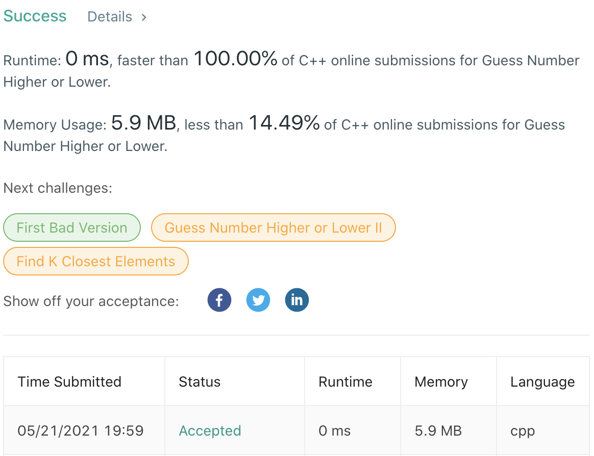

# LeetCode-374

题目链接：https://leetcode.com/problems/guess-number-higher-or-lower/

## 算法思路

题目是一个猜数字游戏。预先给定一个`guess`函数，可以返回当前猜测数字与目标数字的大小关系。我们需要尽快的猜到目标数字。猜数游戏的较快方法就是二分法，每次猜测区间中点即可。

## 代码

```cpp
/**
 * Forward declaration of guess API.
 * @param  num   your guess
 * @return 	     -1 if num is lower than the guess number
 *			      1 if num is higher than the guess number
 *               otherwise return 0
 * int guess(int num);
 */

class Solution {
public:
    int guessNumber(int n) {
        int imax = n, imin = 1, mid = 0, res = 0;
        while (true) {
            mid = (imax - imin) / 2 + imin;
            res = guess(mid);
            if (res == 0)
                return mid;
            else if (res == 1)
                imin = mid + 1;
            else if (res == -1)
                imax = mid - 1;
        }
    }
};
```

## 测试截图


