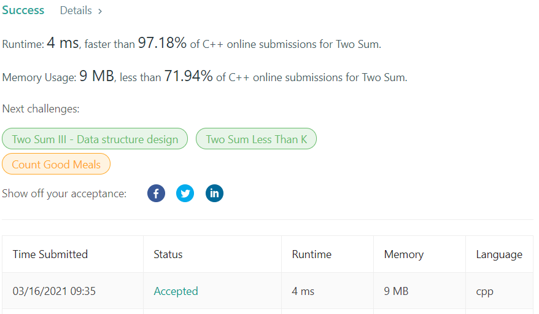

# LeetCode-1 Two Sum

题目链接：https://leetcode.com/problems/two-sum/

## 算法思路

如果直接返回的是求和的两数，排序+双指针算法可以在`O(nlogn)`时间复杂度内完成。

但由于需要返回的是数组下标，排序+双指针的空间复杂度变为`O(n)`(需要额外存储原始数组下标)，时间复杂度为`O(nlogn)`，因此考虑直接利用额外空间优化时间复杂度。

利用 hash map 取数据为 `O(1)` 的时间特性，可以高效利用空间。即利用 hash map 存储数组元素与下标的对应关系，在遍历数组同时，查找 `target-nums[i]` 是否在 hash map 中。如果在，直接返回，否则更新 `map[nums[i]] = i`。

*实现细节*

1. *cpp 中 unordered map 较 map 更接近 hash map*
2. *cpp 的 map 元素初始值为 0，为了避免与 0 下标产生冲突，存储 1-indexed下标*

## 代码

```cpp
class Solution {
public:
    vector<int> twoSum(vector<int>& nums, int target) {
        unordered_map<int, int> m;
        for (int i = 0; i < nums.size(); ++i) {
            if (m[target-nums[i]] == 0) m[nums[i]] = i + 1;
            else    return vector<int> {i, m[target-nums[i]]-1};
        }
        
        return vector<int> {0, 0};
    }
};
```

## 测试截图


