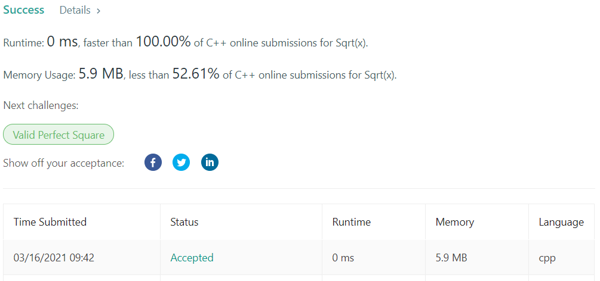

# LeetCode-69 Sqrt(x)

题目链接：https://leetcode.com/problems/sqrtx/

## 算法思路

要求寻找不大于`Sqrt(x)`的最大正整数。最简单的暴力算法是遍历`[1, n/2]`，当数`i`的平方大于`x`时，直接返回`i-1`即可，时间复杂度为`O(n)`。

因为暴力算法是遍历确定长度的数组，所以可以考虑使用二分算法进行优化，将时间复杂度降为`O(logn)`。

*实现细节*

1. 二分终止条件为 `lo <= hi`，搜索区间为双闭，所以更新 lo，hi 时，注意 `+1` 和 `-1`
2. 二分停止前的最后一轮遍历时，有`lo = hi`；此时，无论是 `lo = mid + 1`(target 比 mid 大) 还是 `hi = mid - 1`(target 比 mid 小)，返回 `lo-1` 即可

## 代码

```cpp
class Solution {
public:
    int mySqrt(int x) {
        if (x < 2)  return x;
        
        int lo = 2, hi = x / 2, mid = 0;
        while (lo <= hi) {
            mid = lo + (hi - lo) / 2;
            if (mid == x / mid) return mid;
            else if (mid < x / mid) lo = mid + 1;
            else if (mid > x / mid) hi = mid - 1;
        }
        
        return lo - 1;
    }
};
```

## 测试截图


