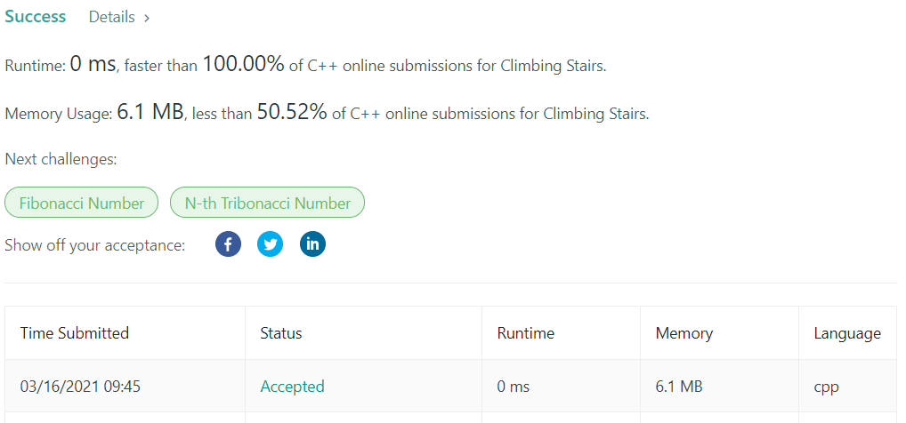

# LeetCode-70 Climbing Stairs

题目链接：https://leetcode.com/problems/climbing-stairs/

## 算法思路

动态规划的入门题目。定义`dp[i]`为第`i`级台阶的到达方法数目，则动态方程为：`dp[i] = dp[i-1] + dp[i+1]`，因为第`i`级台阶可以由第`i-1`级台阶或第`i-2`级台阶到达，方法数为二者的叠加。最后，初始化数组，可以在`O(n)`时间复杂度内得到答案。

*实现细节*

1. 避免下标干扰，动态数组使用 `n+1` 的空间
2. 空间复杂度可以优化为`O(1)`，但为了保持动态规划的模板，这里使用常规的动态数组，空间复杂度为`O(n)`

## 代码

```cpp
class Solution {
public:
    int climbStairs(int n) {
        if (n < 3)  return n;
        
        vector<int> dp(n+1, 0);
        dp[1] = 1, dp[2] = 2;

        for (int i = 3; i <= n; ++i) {
            dp[i] = dp[i-1] + dp[i-2];
        }
        
        return dp[n];
    }
};
```

## 测试截图


